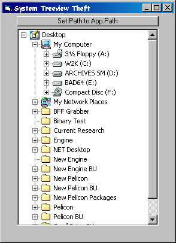



## Bobo System Treeview Thievery

### Description

This is a quick demo of thievery. It demonstrates how to steal

the Treeview from the BrowseForFolder dialog for use by

us poor VB coders.
 
### More Info
 
Prividing a Treeview for navigating local hard drives can be tricky.

Getting it to also include the LAN is even trickier. The task when

using a VB Treeview, whilst not impossible by any means, involves

quite a lot of code and is never quite as fast as Windows.

The job becomes even harder when trying to obtain all

the System Icons.

             |
---                |---
**Submitted On**   |2002-10-20 17:45:02
**By**             |[MrBobo](https://github.com/Planet-Source-Code/PSCIndex/blob/master/ByAuthor/mrbobo.md)
**Level**          |Intermediate
**User Rating**    |5.0 (124 globes from 25 users)
**Compatibility**  |VB 6\.0
**Category**       |[Windows API Call/ Explanation](https://github.com/Planet-Source-Code/PSCIndex/blob/master/ByCategory/windows-api-call-explanation__1-39.md)
**World**          |[Visual Basic](https://github.com/Planet-Source-Code/PSCIndex/blob/master/ByWorld/visual-basic.md)
**Archive File**   |[Bobo\_Syste14845210202002\.zip](https://github.com/Planet-Source-Code/mrbobo-bobo-system-treeview-thievery__1-40007/archive/master.zip)

